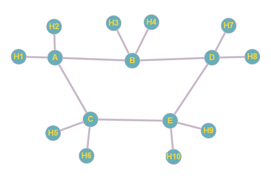

# Simulador de Rede com Roteadores e Protocolo de Estado de Enlace

Este projeto implementa uma rede simulada com roteamento por estado de enlace, onde roteadores Python em containers Docker trocam pacotes LSA para construir um mapa completo da rede e calcular rotas ótimas usando o algoritmo de Dijkstra, enquanto hosts simulados se comunicam através dessa infraestrutura, demonstrando na prática os princípios de redes distribuídas com mecanismos de flooding controlado, atualização dinâmica de rotas e tolerância a falhas em um ambiente isolado e reproduzível.

---

## Descrição

Este projeto implementa uma **rede de computadores simulada** onde roteadores utilizam o protocolo de **Estado de Enlace (Link-State Routing)** para determinar os melhores caminhos de comunicação. Desenvolvido em Python e containerizado com Docker, o sistema simula o comportamento de:

- **Roteadores inteligentes** que constroem e mantêm mapas completos da rede
- **Hosts comunicantes** que trocam mensagens através da infraestrutura de roteamento
- **Enlaces dinâmicos** com custos variáveis

---

## Como Funciona

### Roteadores

- Cada roteador mantém uma **visão completa da rede** através da LSDB (Link State Database), atualizada dinamicamente
- Periodicamente (a cada 30 segundos), os roteadores **enviam LSAs** (Link State Advertisements) contendo:
  - Seu identificador único
  - Lista de vizinhos diretos
  - Custo de cada enlace
- Os LSAs são **propagados por flooding** - cada roteador retransmite os pacotes recebidos para todos seus vizinhos, exceto o remetente original
- Quando a LSDB é atualizada, o roteador executa o **algoritmo de Dijkstra** para:
  1. Calcular os caminhos mais curtos para todos os destinos
  2. Atualizar sua tabela de roteamento
  3. Determinar o próximo salto para cada destino possível

### Hosts

- Os hosts operam como **terminais de comunicação**, conectados a um roteador específico
- Implementam um protocolo básico com:
  - **Envio inicial** de 100 mensagens para destinos aleatórios
  - **Respostas automáticas** quando recebem mensagens
  - **Confirmações (ACKs)** para garantir entrega
- Utilizam mecanismos de:
  - Numeração sequencial de pacotes
  - Retransmissão após timeout (5 segundos)
  - Limite de 3 tentativas de retransmissão

### Comunicação

- A troca de mensagens ocorre via **sockets UDP**, simulando um meio não confiável
- Todos os pacotes seguem um **formato JSON** padronizado contendo:
  - Tipo (LSA/dados/ACK)
  - Identificação de origem/destino
  - Número de sequência
  - Timestamp
  - Payload (para mensagens de dados)
  - TTL (Time-To-Live)
- Os roteadores **encaminham pacotes** de dados consultando suas tabelas de roteamento atualizadas
- A **latência natural** da rede é simulada pelos delays de processamento em cada salto

### Tolerância a Falhas

- O sistema detecta automaticamente:
  - Enlaces inativos (por falta de atualizações periódicas)
  - Pacotes perdidos (via timeout de ACKs)
- Reage através de:
  - Recalculação de rotas alternativas
  - Retransmissão de pacotes não confirmados
  - Atualização da topologia na LSDB

---

## Topologia da Rede

A topologia abaixo representa os roteadores conectados por enlaces, e hosts conectados aos roteadores.



> *Legenda:*
> - Os nós **A a E** são roteadores com enlaces bidirecionais.
> - Os nós **H1 a H10** são os hosts conectados aos seus roteadores.

---

## Justificativa do Protocolo Escolhido

Este projeto optou por implementar um protocolo de **estado de enlace (Link-State Routing)** em vez de protocolos de **vetor de distância** como RIP, pelos seguintes motivos:

- **Precisão Global:** Cada roteador mantém uma visão completa da topologia da rede.
- **Convergência Rápida:** Com base no algoritmo de Dijkstra, as rotas são recalculadas eficientemente após cada mudança.
- **Evita Loops:** O conhecimento da topologia completa reduz drasticamente o risco de roteamento em loop.
- **Escalabilidade:** Mais adequado para redes maiores, pois a propagação de LSAs é controlada por números de sequência.

Este modelo é inspirado em protocolos reais como o **OSPF (Open Shortest Path First)**, utilizado em redes de médio e grande porte.

---

## Instruções para executar os containers

1. Garanta que o Docker e Docker Compose estão instalados
2. Acesse o diretório onde está localizado o arquivo docker-compose.yml
3. Execute o comando abaixo na raiz do projeto (onde está o `docker-compose.yml`)

```bash
docker-compose up -d
```

4. Para encerrar e remover os containers:

```bash
docker-compose down
```

### Acessando o terminal de um container

É possível abrir um terminal interativo para qualquer container com:

```bash
docker exec -it <nome_container> bash
```

Por exemplo:

```bash
docker exec -it router_a bash
docker exec -it host_b2 bash
```

Para ver os logs em tempo real:

```bash
docker-compose logs -f <nome_container>
```

Por exemplo:

```bash
docker-compose logs -f router_a
docker-compose logs -f host_a1
```

Para testar se um container consegue alcançar outro via IP:

```bash
docker exec -it host_a1 bash
ping 10.0.1.100                 # Exemplo: ping do host_a1 para o router_a
ping 10.0.2.3                   # Exemplo: ping do host_a1 para o host_b2
```

Para visualizar a tabela de roteamento de um container:

```bash
docker exec -it router_a bash
ip route
```

---

## Links Importantes

- [Relatório do Projeto](https://www.overleaf.com/read/nyspgfgnfqzx#aba959)
- [Vídeo de Demonstração]()